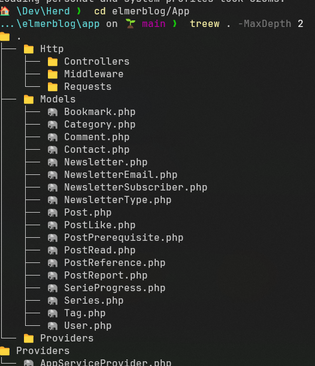

# DirectoryTree 🌲

A PowerShell module for displaying directory trees with icons and formatting options. DirectoryTree enhances the traditional tree view with file-type icons, size information, and various formatting options to make directory exploration more intuitive and visually appealing.



## ✨ Features

- 📁 Display directory structure with intuitive icons
- 📏 Show file sizes with human-readable format
- 🕒 Display last modified dates
- 🔍 Configurable depth traversal
- 🚫 Exclude specific folders and file extensions
- 💾 Save output to file
- 👁️ Toggle hidden files visibility
- 🎨 Unicode icons for different file types

## 🚀 Installation

Install from PowerShell Gallery:

```powershell
Install-Module -Name DirectoryTree -Scope CurrentUser
```

Or manually:

```powershell
git clone https://github.com/elmersh/DirectoryTree
cd DirectoryTree
# Import for current session
Import-Module .\DirectoryTree.psd1
```

## 📖 Usage

### Basic Examples

```powershell
# Basic directory tree
Show-DirectoryTree .

# Using the shorter alias
treew .

# Show with file sizes
Show-DirectoryTree . -ShowFileSize

# Show with last modified dates
Show-DirectoryTree . -ShowLastModified
```

### Advanced Examples

```powershell
# Exclude multiple folders and show hidden files
Show-DirectoryTree . -ExcludeFolders @("node_modules", "bin", ".git") -ShowHidden

# Limit depth and save to file
Show-DirectoryTree . -MaxDepth 3 -OutputFile "tree.txt"

# Combine multiple options
Show-DirectoryTree . `
    -ShowFileSize `
    -ShowLastModified `
    -ExcludeFolders @("node_modules", "bin") `
    -ExcludeExtensions @(".exe", ".dll") `
    -MaxDepth 2
```

## ⚙️ Parameters

| Parameter            | Description                         | Default                                               |
| -------------------- | ----------------------------------- | ----------------------------------------------------- |
| `-Path`              | Starting directory path             | Current directory                                     |
| `-ExcludeFolders`    | Array of folder names to exclude    | `@("node_modules", "bin", "obj", ".git", "packages")` |
| `-ExcludeExtensions` | Array of file extensions to exclude | `@()`                                                 |
| `-ShowHidden`        | Include hidden files and folders    | `$false`                                              |
| `-ShowFileSize`      | Display file sizes                  | `$false`                                              |
| `-ShowLastModified`  | Show last modified timestamps       | `$false`                                              |
| `-MaxDepth`          | Maximum directory depth to display  | `-1` (unlimited)                                      |
| `-OutputFile`        | Save output to specified file       | None                                                  |

## 🎨 File Icons

DirectoryTree uses Unicode icons to represent different file types:

- 📁 Folders
- 📄 Text files
- 📊 Data files (CSV, JSON)
- 🖼️ Images
- 📜 Scripts
- 📦 Archives
- And many more...

## 🤝 Contributing

Contributions are welcome! Please feel free to submit a Pull Request. For major changes, please open an issue first to discuss what you would like to change.

1. Fork the Project
2. Create your Feature Branch (`git checkout -b feature/AmazingFeature`)
3. Commit your Changes (`git commit -m 'Add some AmazingFeature'`)
4. Push to the Branch (`git push origin feature/AmazingFeature`)
5. Open a Pull Request

## 📝 License

This project is licensed under the MIT License - see the [LICENSE](LICENSE) file for details.

## 🙏 Acknowledgments

- Inspired by the Unix `tree` command
- Icons based on common file type representations
- Thanks to all contributors and users of this module

## 📞 Support

If you encounter any issues or have questions:

- Open an issue in the GitHub repository
- Check existing issues for solutions
- Reach out through GitHub discussions

---

Made with ❤️ by [Elmer S.]
